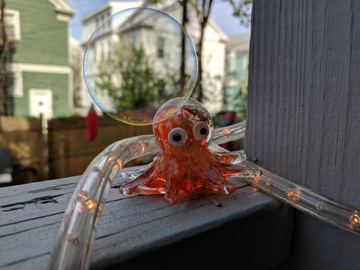

Hello humans!

This is the readme to my portfolio. I built this page from scratch,
and I update it as I learn more about accessibility and good UX
practices. And also when I build something new I want to share. The
first four projects featured (closer to the bottom of the page) were
built as part of my immersive program at General Assembly. I don't do
much updating for them because these were designed to have user
actions behind a login wall, which gets remarkably obnoxious when
testing every minor thing. They work lovely, but could use a good
revamp. Rather than live in the past, I'm channeling my efforts
forward.

If you're reading this, you must be a curious sort, and therefore
should be rewarded. Have a photo of my dear friend, Larry!

